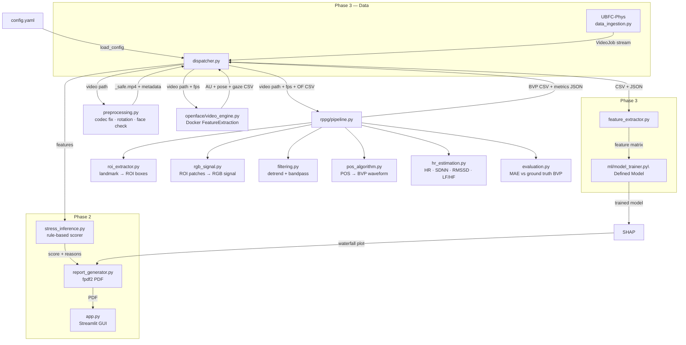

# Design Document Specification (DDS)

**Project:** MOXIE-VASA — Video Analysis for Stress Assessment  
**Version:** 0.5 (Phase 1 — Personal Video Pipeline)  
**Author:** Durvi Bhati  
**Last Updated:** March 2026  

---

## 1. Tool Overview

MOXIE-VASA is a modular pipeline where a central controller (`dispatcher.py`) routes video data through specialised processing modules in a strict linear sequence. Each module has a single responsibility and communicates with the next via files or structured return values — no module directly calls another's internals.

All paths and parameters are managed through `config.yaml`. No paths are hardcoded anywhere in the source code.

---

## 2. Module Descriptions

### Module A: Configuration Loader (`data_ingestion.py` → `load_config`)

**Scope** Configuration and path resolution 
**Responsibility** Loads `config.yaml` from the project root, resolves all `${data_root}` placeholders, creates output directories, and returns a single config dict used by all other modules 

---

### Module B: Dispatcher (`dispatcher.py`)

**Scope** Pipeline orchestration 
**Responsibility** Reads the personal video folder from config, discovers valid video files, and calls preprocessing → OpenFace → rPPG in strict sequence for each video. Collects and reports results. 


> **Phase 3 addition:** `data_ingestion.py` will supply `VideoJob` objects from UBFC-Phys and COHFACE sources. Dispatcher will consume `VideoJob` objects uniformly regardless of source.

---

### Module C: Preprocessing (`preprocessing.py`)

**Scope** Video standardisation 
**Responsibility**  Transcodes any supported format to H.264 MP4 at CRF 15, corrects rotation from metadata flags, runs a fast Haar cascade face presence check, and returns the safe video path plus a metadata dict containing the actual FPS 

---

### Module D: OpenFace Wrapper (`openface/video_engine.py`)

**Scope** Facial behaviour analysis 
**Responsibility** Runs the OpenFace `FeatureExtraction` binary inside the `algebr/openface:latest` Docker container via `subprocess.Popen`. Streams Docker stdout live. Verifies that a non-empty CSV was produced. 
**Extracted features**  AU01–AU45 (`_r` intensity, `_c` presence), head pose (`Rx/Ry/Rz`, `Tx/Ty/Tz`), gaze angles, 68 2D/3D landmarks 

---

### Module E: rPPG Pipeline (`rppg/pipeline.py` and sub-modules)

**Scope** Remote physiological signal extraction 
**Responsibility** Orchestrates the full rPPG chain: ROI extraction from OpenFace landmarks → RGB signal extraction → detrending → bandpass filtering → POS → HR/HRV feature extraction → output saving 

Sub-module breakdown - Covered in SRS

---

### Module F: Feature Extractor (`feature_extractor.py`) — Phase 3

**Scope**  Feature engineering for ML 
**Responsibility** Reads OpenFace CSV and rPPG metrics JSON; computes temporal aggregates (mean, std, max) per AU per condition window; returns a unified feature vector 

---

### Module G: ML Layer (`ml/`) — Phase 3

**Scope** Stress classification and explainability 
**Responsibility**  Trains a Random Forest classifier on UBFC-Phys feature matrices using LOSO cross-validation; saves model with `joblib`; at inference time loads model and generates SHAP waterfall plot 

---

### Module H: Report Generator (`report_generator.py`) — Phase 2

**Scope** Output presentation 
**Responsibility**  Assembles a PDF report from the stress score, HR timeline plot, SHAP waterfall, and AU summary table using `fpdf2` 

---

### Module I: Streamlit GUI (`app.py`) — Phase 2

**Scope**  User interface 
**Responsibility** Provides a web-based interface for video upload, pipeline progress display, results visualisation, and PDF report download. Calls `dispatcher.main()` and consumes result dicts directly. 

---

## 3. Module Dependency Diagram



---

## 4. Data Flow Summary

```
Raw video
    │
    ▼
preprocessing.py ──────────────────► _safe.mp4 + metadata (fps, resolution)
    │
    ▼
openface/video_engine.py ──────────► Pipeline_Output/result_openface/{stem}.csv
    │                                  (AUs, pose, gaze, 68 landmarks, per frame)
    ▼
rppg/pipeline.py
    ├─ roi_extractor.py ────────────► ROI boxes per frame (from OF landmarks)
    ├─ rgb_signal.py ───────────────► Weighted RGB signal (N_valid_frames × 3)
    ├─ filtering.py ────────────────► Detrended + bandpass-filtered signal
    ├─ pos_algorithm.py ────────────► BVP waveform (N_frames,)
    └─ hr_estimation.py ────────────► HR, SDNN, RMSSD, LF/HF
    │
    ▼
Pipeline_Output/result_rppg/
    ├── {stem}_bvp.csv
    ├── {stem}_rgb.csv
    └── {stem}_metrics.json
```

---

## 5. File & Directory Structure

```
moxie_vas_tool/
├── config.template.yaml        # Committed — placeholder paths
├── config.yaml                 # Gitignored — real local paths
├── .gitignore
├── app.py                      # Phase 2 — Streamlit entry point
├── docs/
│   ├── SRS.md
│   ├── DDS.md
│   ├── WBS.md
│   └── datasets.md
├── src/
│   └── Moxie/
│       ├── dispatcher.py
│       ├── preprocessing.py
│       ├── data_ingestion.py
│       ├── feature_extractor.py   # Phase 3
│       ├── feature_fusion.py      # Phase 3
│       ├── report_generator.py    # Phase 2
│       ├── plot_utils.py          # Phase 2
│       ├── openface/
│       │   ├── __init__.py
│       │   └── video_engine.py
│       ├── openpose/
│       │   └── __init__.py        # Phase 4 stub
│       ├── rppg/
│       │   ├── __init__.py
│       │   ├── pipeline.py
│       │   ├── roi_extractor.py
│       │   ├── rgb_signal.py
│       │   ├── filtering.py
│       │   ├── pos_algorithm.py
│       │   ├── hr_estimation.py
│       │   └── evaluation.py
│       └── ml/                    # Phase 3
│           ├── __init__.py
│           ├── model_trainer.py
│           ├── stress_inference.py
│           └── explainability.py
├── tests/
│   ├── test_rppg_engine.py
│   └── test_video_analysis.py
└── tutorials/
    └── moxie_vasa_demo.ipynb      # Phase 2
```

---
